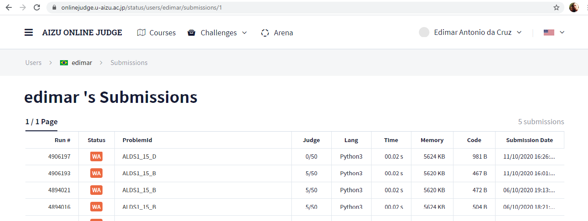

# Trabalho de Programação -- Algoritmos Gulosos -- Parte 2
**Autor:** Edimar Antonio da Cruz
**Data:** 11 de outubro de 2020
**Problema:** ALDS1_15_D -- – Huffman Coding
## Sobre a Solução
Este diretório contém o código fonte gerado para solucionar o problema ALDS1_15_D
do *Aizu Online Judge*. O problema recebeu veredito Wrong answer (WA), como mostrado na
figura abaixo:

O algoritmo parece atender a alguns casos, mas não se mostrou eficiente
O programa foi desenvolvido em Python.
